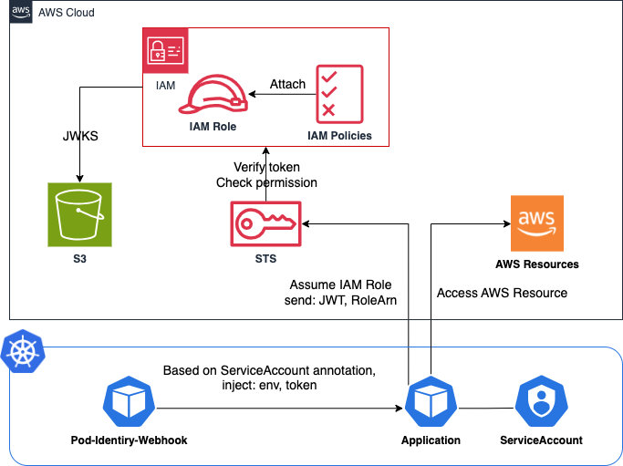
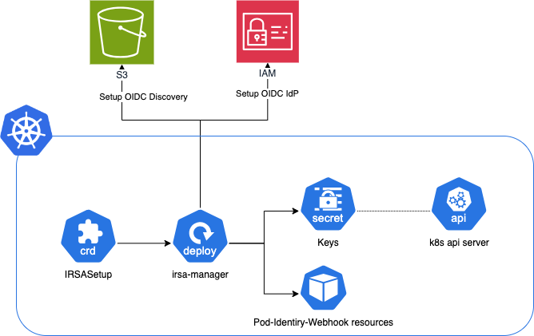
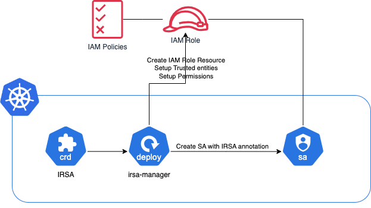

# IRSA Manager

[](https://github.com/kkb0318/irsa-manager/releases)
[](https://github.com/kkb0318/irsa-manager/actions/workflows/ci.yaml)
[](https://artifacthub.io/packages/search?repo=irsa-manager)

IRSA Manager allows you to easily set up IAM Roles for Service Accounts (IRSA) on non-EKS Kubernetes clusters.



## Introduction

IRSA (IAM Roles for Service Accounts) allows Kubernetes service accounts to assume AWS IAM roles.
This is particularly useful for providing Kubernetes workloads with the necessary AWS permissions in a secure manner.

## Prerequisites

Before you begin, ensure you have the following:

- A running Kubernetes cluster (non-EKS).
- Helm installed on your local machine.
- AWS user credentials with appropriate permissions.
  - The permissions should allow irsa-manager to call the necessary AWS APIs. You can find all the APIs that irsa-manager calls in the internal/aws/aws.go interfaces.

```json
{
  "Version": "2012-10-17",
  "Statement": [
    {
      "Effect": "Allow",
      "Action": [
        "iam:CreateOpenIDConnectProvider",
        "iam:DeleteOpenIDConnectProvider",
        "iam:CreateRole",
        "iam:UpdateAssumeRolePolicy",
        "iam:AttachRolePolicy",
        "iam:DeleteRole",
        "iam:DetachRolePolicy",
        "sts:GetCallerIdentity",
        "s3:*"
      ],
      "Resource": "*"
    }
  ]
}
```

## Setup

Follow these steps to set up IRSA on your non-EKS cluster:

1. Set AWS Secret for IRSA Manager

Create a secret for irsa-manager to access AWS:

```console
kubectl create secret generic aws-secret -n irsa-manager-system \
  --from-literal=aws-access-key-id=<your-access-key-id> \
  --from-literal=aws-secret-access-key=<your-secret-access-key> \
  --from-literal=aws-region=<your-region> \
  --from-literal=aws-role-arn=<your-role-arn>  # Optional: Set this if you want to switch roles

```

2. install helm

Add the irsa-manager Helm repository and install irsa-manager:

```console
helm repo add kkb0318 https://kkb0318.github.io/irsa-manager
helm repo update
helm install irsa-manager kkb0318/irsa-manager -n irsa-manager-system --create-namespace
```

3. Create an IRSASetup Custom Resource



Define and apply an IRSASetup custom resource according to your needs.

```yaml
apiVersion: irsa-manager.kkb0318.github.io/v1alpha1
kind: IRSASetup
metadata:
  name: irsa-init
  namespace: irsa-manager-system
spec:
  cleanup: false
  discovery:
    s3:
      region: <region>
      bucketName: <S3 bucket name>
```

Check the IRSASetup custom resource status to verify whether it is set to true.

> [!NOTE]
> Please ensure that only one IRSASetup resource is created.

4. Modify kube-apiserver Settings

If the IRSASetup status is true, a key file (Name: `irsa-manager-key` , Namespace: `kube-system` ) will be created. This is used for signing tokens in the kubernetes API.
Execute the following commands on the control plane server to save the public and private keys locally for Kubernetes signatures:

```console
kubectl get secret -n kube-system irsa-manager-key -o jsonpath="{.data.ssh-privatekey}" | base64 --decode | sudo tee /path/to/file.key > /dev/null
kubectl get secret -n kube-system irsa-manager-key -o jsonpath="{.data.ssh-publickey}" | base64 --decode | sudo tee /path/to/file.pub > /dev/null
```

> [!NOTE]
> Path: `/path/to/file` can be any path you choose.
> If you use kubeadm, it is recommended to set `/etc/kubernetes/pki/irsa-manager.(key|pub)`

Then, modify the kube-apiserver settings to include the following parameters:

- API Audiences

```
--api-audiences=sts.amazonaws.com
```

- Service Account Issuer

```
--service-account-issuer=https://s3-<region>.amazonaws.com/<S3 bucket name>
```

> [!NOTE]
> Add this setting as the first element.
> When this flag is specified multiple times, the first is used to generate tokens and all are used to determine which issuers are accepted.

- Service Account Key File

The public key generated previously can be read by the API server. Add the path for this parameter flag:

```
--service-account-key-file=/path/to/file.pub
```

> [!NOTE]
> If you do not mount /path/to directory, you need to add the volumes field to this path.

- Service Account Signing Key File

The private key (oidc-issuer.key) generated previously can be read by the API server. Add the path for this parameter flag:

```
--service-account-signing-key-file=/path/to/file.key
```

> [!NOTE]
> Overwrite the existing settings.
> If you do not mount /path/to directory, you need to add the volumes field to this path.

For more details, refer to the [Kubernetes documentation](https://kubernetes.io/docs/tasks/configure-pod-container/configure-service-account/#serviceaccount-token-volume-projection).

## How To Use

You can set up IRSA for any Kubernetes ServiceAccount by configuring the necessary IAM roles and policies.
While you can use the provided IRSA custom resources, it is also possible to set up IRSA manually by configuring the `iamRole`, `iamPolicies`, and `ServiceAccount` directly.

### Using IRSA Custom Resources



The following example shows how irsa-manager sets up the `irsa1-sa` ServiceAccount in the `kube-system` and `default` namespaces with the AmazonS3FullAccess policy using IRSA custom resources:

```yaml
apiVersion: irsa-manager.kkb0318.github.io/v1alpha1
kind: IRSA
metadata:
  name: irsa-sample
  namespace: irsa-manager-system
spec:
  cleanup: true
  serviceAccount:
    name: irsa1-sa
    namespaces:
      - kube-system
      - default
  iamRole:
    name: irsa1-role
  iamPolicies:
    - AmazonS3FullAccess
```

This configuration simplifies the setup process by combining the creation of the IAM role, policies, and service account into a single custom resource.

### Manual setup

Alternatively, you can configure IRSA manually without using the IRSA custom resources by following these steps:

- Create the IAM Role:
  - Manually create an IAM role in AWS with the necessary trust policy to allow the Kubernetes service account to assume the role.

```json
{
  "Version": "2012-10-17",
  "Statement": [
    {
      "Effect": "Allow",
      "Principal": {
        "Federated": "arn:aws:iam::<account-id>:oidc-provider/s3-<region>.amazonaws.com/<S3 bucket name>"
      },
      "Action": "sts:AssumeRoleWithWebIdentity",
      "Condition": {
        "StringEquals": {
          "s3-<region>.amazonaws.com/<S3 bucket name>:sub": "system:serviceaccount:<namespace>:<name>"
        }
      }
    }
  ]
}
```

- Attach IAM Policies:
  - Attach the required IAM policies (e.g., AmazonS3FullAccess) to the IAM role.
- Annotate the Kubernetes ServiceAccount:
  - Annotate the Kubernetes service account with the ARN of the IAM role.

```yaml
apiVersion: v1
kind: ServiceAccount
metadata:
  name: <name>
  namespace: <namespace>
  annotations:
    eks.amazonaws.com/role-arn: arn:aws:iam::<account-id>:role/<role name>
```

## Verification

To verify the above example and ensure the IRSA works correctly, you can check the following job.
There is a Kubernetes job that will put one file into the S3 bucket, confirming that the Pod can assume the role to get S3 write permission:

```bash
cd validation
sh s3-echoer.sh
```

## API Reference

You can find the reference in the [Reference](./docs/api.md) file.

## License

This project is licensed under the MIT License - see the [LICENSE](./LICENSE) file for details.

## Acknowledgments

In creating this OSS project, I referred to several sources and would like to express my gratitude for their valuable information and insights.

The necessity of this project was realized through discussions in the following issue:

- https://github.com/kubernetes-sigs/cluster-api-provider-aws/issues/3560

Additionally, the implementation was guided by the following repositories:

- [smalltown/aws-irsa-example](https://github.com/smalltown/aws-irsa-example)
- [aws/amazon-eks-pod-identity-webhook](https://github.com/aws/amazon-eks-pod-identity-webhook)
